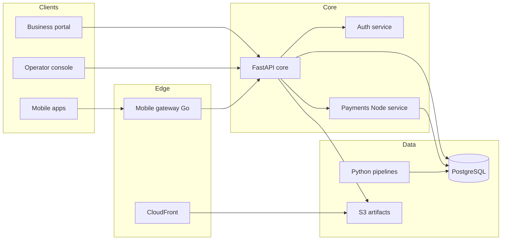

# ArkoBank architecture (demo)

ArkoBank is organised as a modular platform with clear separation between customer
channels, operator tooling, and payment processing.

## Runtime boundaries

- **Core API** orchestrates accounts, documents, community surfaces, and integrations.
- **Auth service** issues bearer tokens and performs directory lookups for operators.
- **Payments service** executes capture/settlement routines against card rails proxies.
- **Data pipeline** consolidates ledger extracts for regulatory reporting packs.

This document describes the fictional demo system only; deployment topology is not
maintained for production use.
